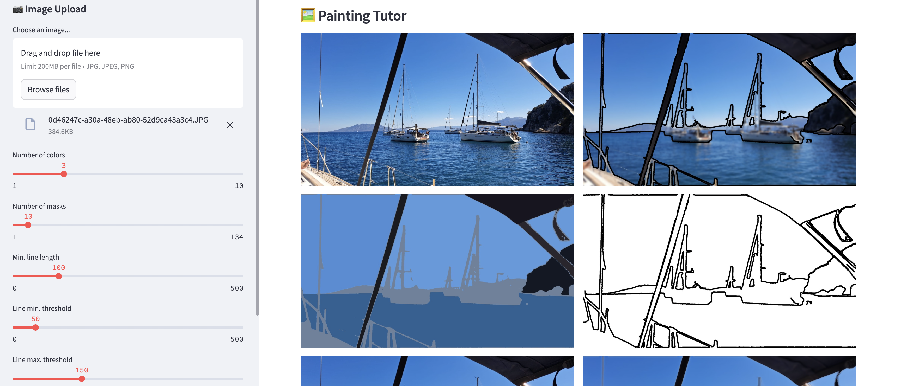

# Paining tutor 🎨

An app that helps you paint from pictures by bringing them down to basic lines, shapes and colors.



## Set up 💻

1. Make sure you have `uv` installed
2. Install dependencies in virtual environment:

    ```bash
    uv sync
    ```

3. Download the model with:

    ```bash
    wget -q https://dl.fbaipublicfiles.com/segment_anything/sam_vit_h_4b8939.pth -P model
    ```

4. Run the app, upload pictures and have fun! 🖼️

    ```bash
    uv run streamlit run src/painting_tutor/app/app.py
    ```

Tip: clean up the `cache` folder every once in a while to save disk space.

## Notes 🚨

The algorithm takes averages over colors of segments in the images. These are often not the same
colors as one would normally paint! This is because averages over many colors tend to become gray.
Increasing the number of colors per segment or mask will get you closer to the true colors.

## Resources 📚

See [segmentation tutorial](https://colab.research.google.com/github/roboflow-ai/notebooks/blob/main/notebooks/how-to-segment-anything-with-sam.ipynb?ref=blog.roboflow.com#scrollTo=Aszw1OxBwowI).

Other models available:

```bash
wget -q https://dl.fbaipublicfiles.com/segment_anything/sam_vit_b_01ec64.pth -P model
wget -q https://dl.fbaipublicfiles.com/segment_anything/sam_vit_l_0b3195.pth -P model
wget -q https://dl.fbaipublicfiles.com/segment_anything/sam_vit_h_4b8939.pth -P model
```
